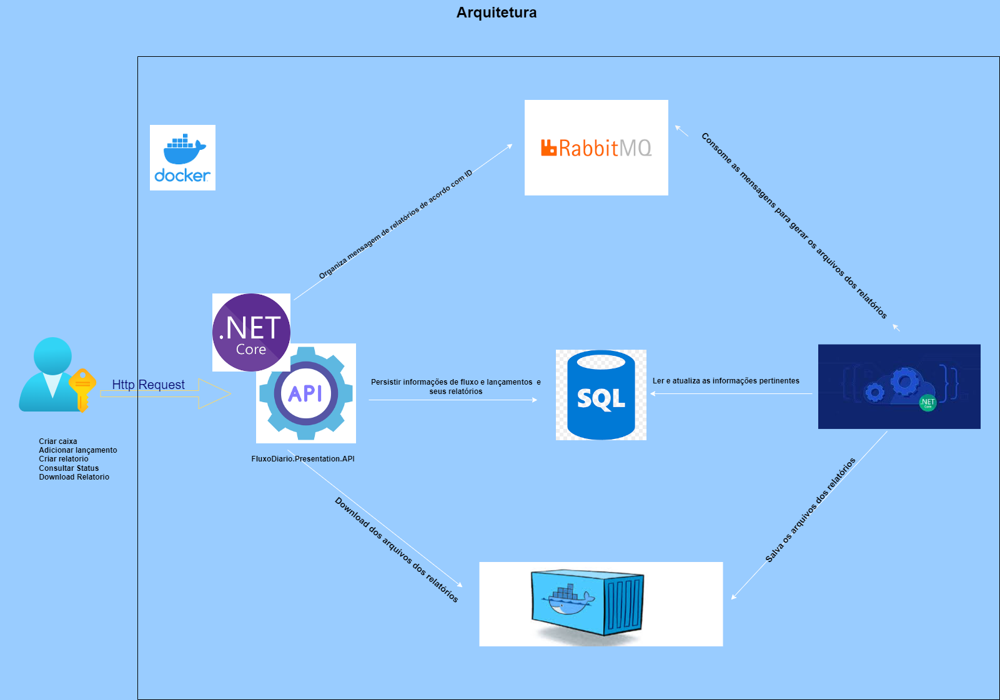
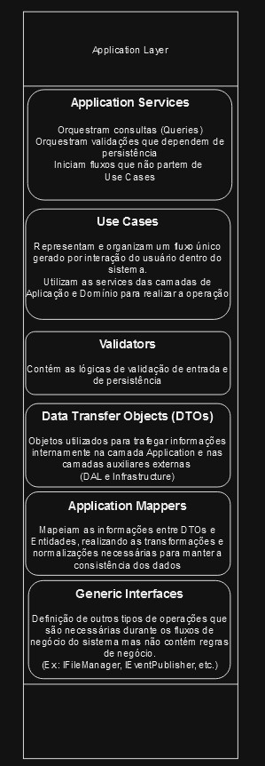

# Sistema de controle de Fluxo Diario
Projeto de controle de Fluxo de Caixa em .NET 8 utilizando Docker, SQL Server e RabbitMQ.

## Índice
- [Tecnologias](#tecnologias)
- [Frameworks/Libraries](#frameworks-libraries)
- [Arquitetura](#arquitetura)
- [Contextualização do projeto](#contexto-projeto)
- [Executando o Projeto](#executando-projeto)
- [Use Cases](#casos-uso)
- [Testes](#testes)
- [Evoluções do projeto e observações finais](#evoluções)

##  Tecnologias
Para a execução do projeto foram utilizadas as seguntes tecnologias:

### .NET 8.0 | C# 12
Para construir a lógica da aplicação foi utilizada C# (versão 12) como linguagem de programação, através do framework .NET 8.0; Para a escolha da linguagem e framework foi levado em consideração sua popularidade, sendo uma linguagem consolidada no mercado há anos. Referente à versão, utilizei .NET 8.0 por ser a versão LTS mais recente, e por consequência a versão 12 do C#.

### MS SQL Server 2022
Para persistir as informações foi utilizado o banco relacional MS SQL Server 2022 - versão mais recente do SGDB; Além de ser um dos databases com maior aderência no mercado, tem um fácil gerenciamento através do [SSMS](https://learn.microsoft.com/pt-br/sql/ssms/sql-server-management-studio-ssms?view=sql-server-ver16) - ferramenta completa para construir queries, visualizar estruturas, analisar planos de execuções através de uma interface gráfica integrada e outras features para facilitar o gerenciamento do DB.

### Docker
Para facilitar a distribuição e escalabilidade da aplicação, foi utilizado o [Docker](https://www.docker.com/) como tecnologia para construir a solução com containers.

### RabbitMQ
Para realizar a comunicação assíncrona via mensageria foi utilizado o RabbitMQ (Versão 3), por ser uma ferramenta extremamente popular, ter suporte através de diversos frameworks para .NET e é open-source, facilitando o processo de implementação no projeto.

##  Frameworks/Libraries

### Serilog - [GitHub](https://github.com/serilog/serilog) 
Biblioteca de Logging completa e compatível com diversas saídas como Console, Arquivos, ElasticSearch, entre outras.

### FluentResults - [GitHub](https://github.com/altmann/FluentResults)
Biblioteca para facilitar o tráfego de informações e resultados de operações durante a execução dos fluxos da aplicação.

### Swagger - [GitHub](https://github.com/domaindrivendev/Swashbuckle.AspNetCore)
Biblioteca para disponibilizar documentações e exemplos automáticos das rotas disponibilizadas na API.

### Entity Framework Core - [GitHub](https://github.com/dotnet/efcore)
ORM para realizar a conexão com o banco de dados, gerenciar as Queries e Commands, gerar e aplicar migrações e abstrair os conceitos do DB de forma inteligível no código.

### MassTransit - [GitHub](https://github.com/MassTransit/MassTransit)
Biblioteca consolidada de simples utilização para realizar a publicação e recebimento de mensagens via Message Queues.

### XUnit - [GitHub](https://github.com/xunit/xunit)
Um dos frameworks de testes de código em .NET mais bem estabelecidos no mercado, sendo oferecido nativamente pelo Visual Studio para realizar os testes unitários e de integração.

### Moq - [GitHub](https://github.com/devlooped/moq)
Ferramenta para realizar o Mock (processo de "imitar" implementações reais) de classes e interfaces, facilitando o processo de desenvolvimento de testes.

##  Arquitetura

### Desenho geral da Solução

### Planejamento do projeto
A aplicação foi projetada de forma robusta para habilitar a aplicação a escalar, tanto na infraestrutura quanto em novas funcionalidades, de forma consistente, confiável e testável.
Para realizar essa tarefa, a arquitetura foi planejada utilizando os seguintes conceitos e padrões arquiteturais:
- DDD
    - Parcialmente: Não haveria tempo nem necessidade de mapear a linguagem ubíqua para esse projeto.
- Clean Architecture
- Publish-Subscriber
    - Para fins demosntrativos, foram mapeados os principais eventos do sistema e seu envio. O único evento utilizado é o `RelatorioCriado`, para ser consumido e gerar o arquivo do relatório.
- CQRS 
    - Parcialmente: Não houve tempo de desenvolver um código separando as Query Models e Command Models; Dito isso, o projeto está preparado para realizar a leitura e escrita de fontes separadas
- Event Sourcing
    - Para agilizar o desenvolvimento, o Event Store utilizado foi uma tabela no DB
- SOLID
- DRY
- Design Patterns
    - Factories
    - Builders
    - Strategy (ver implementação de `Lançamentos`, no contexto `FluxoDiario`)

Vale mencionar que a arquitetura foi planejada visando demonstrar o exemplo de uma aplicação que teria um longo ciclo de vida e, em pouco tempo após a primeira entrega, várias features adicionadas.

Caso o sistema fosse planejado como um contrato único e rápido, sem grandes chances de expansão, a arquitetura seria consideravelmente mais simples, implementando algo como três camadas + Pub-Sub para realizar um fluxo parecido com o envio da mensagem de criação de relatório. Ir além disso numa situação como essa seria contraprodutivo.

### Estrutura do projeto

#### Entry Layer

#### Infrastructure Layer

#### Application Layer

#### Domain Layer

#### Data Access Layer (DAL)

#### Shared Layer

### Mapa de Contexto

#### FluxoDiario Context

#### Relatorios Context

#### Shared Kernel Context

##  Contextualização do projeto
- Datas estão sendo tratadas em UTC (DataHora de brasília + 3 horas)
- Tipos válidos de lançamentos:
    - Débito - 1
    - Crédito - 2
- Tipos válidos de relatórios:
    - Json - 1
- Foi adotada como regra de negócio o caixa não ser permitido ter um saldo negativo para melhorar a exemplificação de validações e aplicações de regras de negócio.

##  Executando o Projeto 
Pré-Requisitos:
- Docker (rodando no WSL)
- Git
- Visual Studio ou outra IDE da sua preferência (Caso queira executar a aplicação no modo Debug)

Passo a passo:
- Clone o projeto localmente
- Com o docker em execução, entre na pasta raiz do projeto e execute o comando `docker-compose up -d`
- Aguarde o download, build e carregamento completo das imagens
- Para facilitar o uso, baixe a [coleção do Postman](./Docs/PostmanCollections/collectionFluxoDiario) e importe ela para ter acesso à todas as rotas disponíveis.
    - Uma alternativa é testar a aplicação utilizando o Swagger, diponibilizado na rota http://localhost:5000/swagger/index.html
##  Use Cases

- Criar Caixa: Realiza a criação de um caixa, solicitando nome e, de forma opcional, o saldo inicial. Retorna o caixa criado.

    - Caso o saldo inicial seja informado (e maior que 0), um lançamento de crédito será automaticamente realizado junto à criação da caixa.
- Adicionar Lançamento: Realiza a inserção de um novo lançamento dentro do caixa informado. Retorna o caixa onde o lançamento foi realizado, onde também estará localizado o novo lançamento.
    - Tipos válidos de lançamento listados na [contextualização do projeto](#contextualização-do-projeto).

- Consultar Saldo: Realiza a consulta do saldo do caixa informado. Retorna o id do caixa e o saldo atual do mesmo.

- Criar Relatório: Solicita a criação do relatório de forma assíncrona. Retorna o registro do relatório criado (somente informações do relatório, não a consolidação do saldo diário em si).

- Consultar Status Relatório: Consulta o status de processamento do relatório informado. Retorna o Id do Relatório e o status do mesmo.

- Download Relatório: Realiza o download do relatório solicitado. Retorna o arquivo do relatório consolidado.

##  Testes
Foram desenvolvidos os seguintes tipos de testes para exemplificar cada um desses tipos de teste. Por questões de tempo, não foi ampliada a cobertura de testes. O planejamento para cada um deles será apresentado em suas descrições:

### Unitários
Testam todas as possibilidades de execução de um método, de forma isolada. Validam se as chamadas internas necessárias foram realizadas.

Idealmente, apresentariam 100% de cobertura (com exceção de DTOs e afins) nas camadas `Domain` e `Application`; Nas outras camadas, alguns pontos mais críticos poderiam ser testados dessa maneira.

Os testes unitários estão no projeto `FluxoDiario.Tests.Unit`
### Integração
Testam um fluxo composto por vários componentes, integrados em uma chamada única para validar os possíveis comportamentos mapeados para a porção testada. Validam se chamadas externas aos componentes integrados foram realizadas corretamente.

Nesse projeto, os testes planejados seriam todos os `UseCases` e `Consumers`, integrados até os repositórios.

Os testes de integração estão no projeto `FluxoDiario.Tests.Integrations`
### End-to-End
Testam a execução da aplicação de ponta-a-ponta, com toda a infraestrutura configurada e ativa. Tem seu ponto de entrada nos endpoints da API, utilizando seu retorno como meio de validação. Normalmente são compostos de fluxos de várias requisições, montando assim um fluxo de uso padrão do sistema.

O planejamento seria desenvolver várias sequências de requisições, representando fluxos como Criar Caixa + Adicionar X Lançamentos + Consultar Saldo, validando se o saldo foi calculado e informado corretamente.

Por praticidade, os testes End-to-End foram desenvolvidos no Postman. Para executá-los, realize o [download](./Docs/PostmanCollections/collectionFluxoDiario.json) da coleção e execute a coleção:

Antes de rodar os testes, configure 1 segundo (1000ms) de delay entre requisições para evitar problemas com a validação da geração do relatório:

Caso o teste do relatório apresente problemas com a configuração apresentada acima, aumente gradualmente o delay entre as requisições - isso pode ser causado pela capacidade da máquina e/ou configuração do WSL presente no ambiente local.
### Carga
Testam a performance e capacidade de lidar com cargas pré-definidas de requisições em rotas específicas ou no sistema como um todo.

Como definido nos requisitos não funcionais, o teste planejado seria de 500 requisições/segundo.

Por questões de tempo, não foi possível configurar testes de carga, mas o planejamento seria montar o teste via JMeter, como uma imagem dentro da estrutura do Docker.

##  Evoluções do projeto e observações finais
Para agilizar o desenvolvimento do projeto, algumas questões importantes, mas não obrigatórias, foram planejadas porém não executadas. Entre as principais (ordendas por relevância x custo de desenvolvimento):

- Autenticação via Identity
    - Para um sistema web como esse, é de suma importância configurar a autenticação do sistema. Seria desenvolvida utilizado o Identity do ASP.NET pela agilidade, fácil customização das informações/roles e compatibilidade nativa com o framework.
- Conversão de Enum para Texto para melhorar relatório
- Middleware de tratamento de exceções
- Implementar relatório em formato CSV
- Implementar lógica para não reprocessar relatórios da mesma data e mesmo caixa
- Separar a solicitação de lançamento do cálculo do lançamento
    - Considerando que nos dias de pico o sistema poderá chegar à 500 requests por segundo, o cálculo do lançamento sendo executado de forma síncrona com a criação do registro do lançamento pode se tornar um problema, tanto de performance quanto pela regra de negócio de invalidar débitos que causassem um saldo negativo. A solução proposta seria separar a solicação do lançamento do cálculo do saldo. 
    - Detalhes:
        - Seria parecido com o fluxo de geração de relatório, uma mensagem seria criada após a inserção do lançamento no banco - isso necessita a criação de um status para o Lançamento. 
        - Quando recebida pelo consumer, ele irá distribuir sua mensagem para uma fila interna (`Channels`) específica para sua caixa, que por sua vez será lida de forma síncrona por workers dedicados por fila.
        - Ao processar um lançamento inválido, o sistema atualizaria seu status para inválido, e outra rota seria criada para realizar o ajuste
            - Uma alternativa seria simplesmente desconsiderar o lançamento
    - Essa implementação melhoraria a performance da rota de inserção de lançamentos e possibilitaria a validação de cada um deles, sem comprometer a confiabilidade do saldo.
- Implementar Graceful Shutdown para o Worker
    - Considerado pelo fato de existir a possibilidade do Worker ser encerrado abruptamente - assim a geração dos relatórios que estiverem em andamento seria encerrada de forma controlada.
- Implementação do ELK como serviço principal de visualização de logs.
